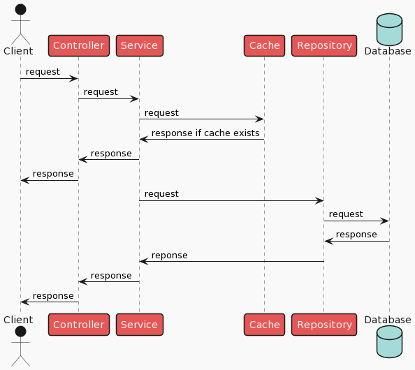
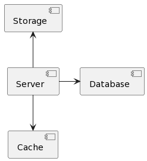
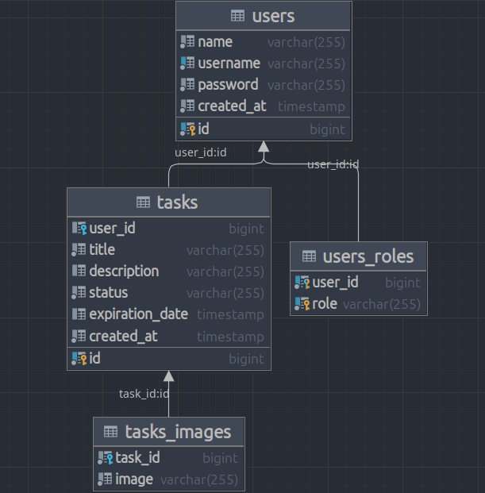

# tasklist

This REST API application allows you to organize the creation and tracking of your tasks.

* [Diagrams](#sequence-diagram)
* [Environments](#environments)
* [Quick start](#quick-start)

## Technologies
Spring(Boot, Security, JPA), JWT, Swagger, Docker, PostgreSQL, Redis, Mybatis, MinIO, Liquibase, JUnit, Mockito, JaCoCo
 
## Features
  * User can:
     * Login and register(with jwt tokens)
     * Create tasks
     * Upload profile
     * Upload images for tasks(use MinIO storage)
  * Util
      * Checkstyle and Github Actions
      * Swagger UI
      * JaCoCo plugin

## Sequence diagram



## Component diagram



Main application communicates with cache (Redis), main database (Postgresql), file storage (MinIO).

## Class diagram



We have two main tables - **Users** and **Tasks**.

**Users** table represents user in this application. User can login, create and update tasks.

User can have roles - `ROLE_USER` or `ROLE_ADMIN`.

**Tasks** table represents task in this application. Task can be created and deleted by user.

Task can have images.

## Environments

To run this application you need to create `.env` file in root directory with next environments:

- `POSTGRES_HOST` - host of Postgresql database
- `POSTGRES_USERNAME` - username for Postgresql database
- `POSTGRES_PASSWORD` - password for Postgresql database
- `POSTGRES_DATABASE` - name of Postgresql database
- `POSTGRES_SCHEMA` - name of Postgresql schema
- `REDIS_HOST` - host of Redis instance
- `REDIS_PORT` - port of Redis instance
- `REDIS_PASSWORD` - password for Redis
- `JWT_SECRET` - secret string for JWT tokens
- `MINIO_BUCKET` - name of bucket for MinIO
- `MINIO_URL` - URL of MinIO instance
- `MINIO_ACCESS_KEY` - access key of MinIO
- `MINIO_SECRET_KEY` - secret key of MinIO

## Quick start
1. Clone this repo into folder.

```Bash
git clone https://github.com/qReolq/tasklist.git
cd tasklist
```
2. Start docker compose

```Bash
docker compose up
```
3. Go to localhost:8080/swagger-ui/index.html#/
